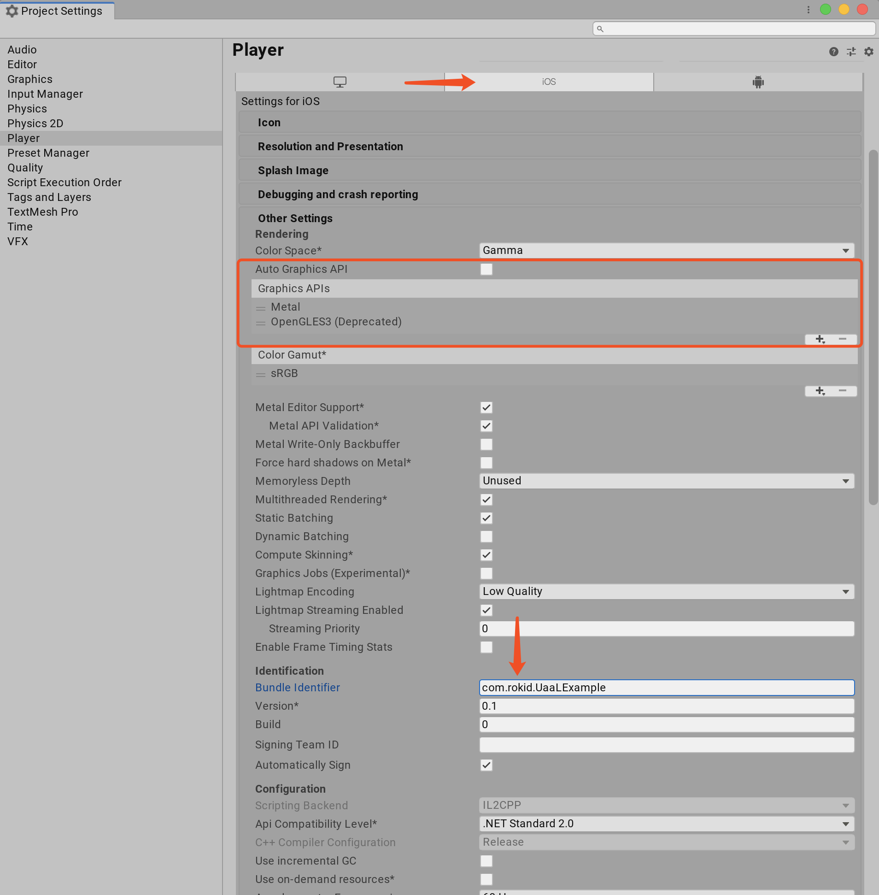
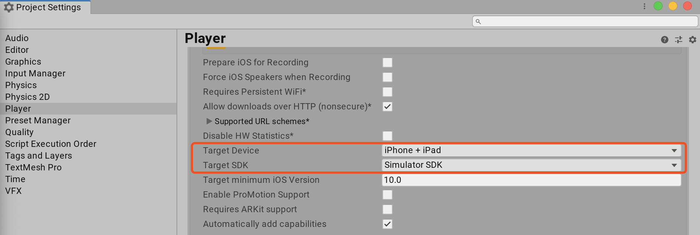
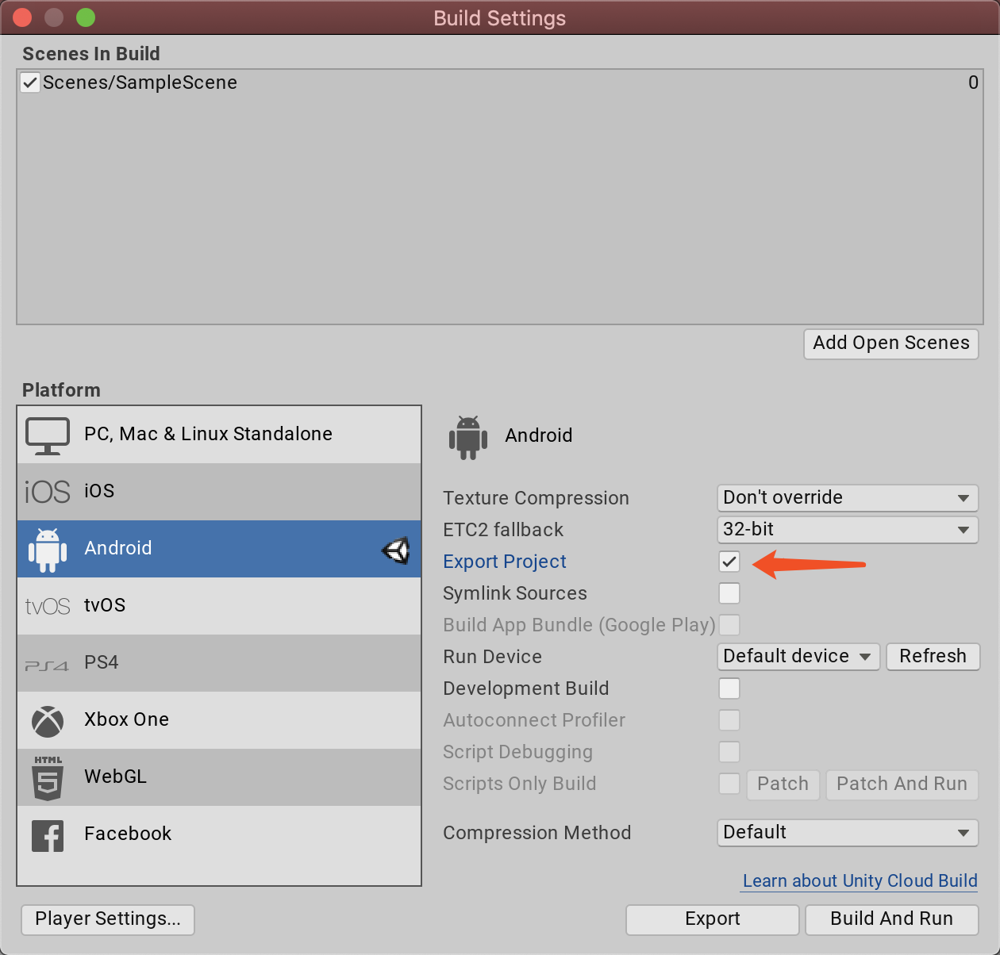
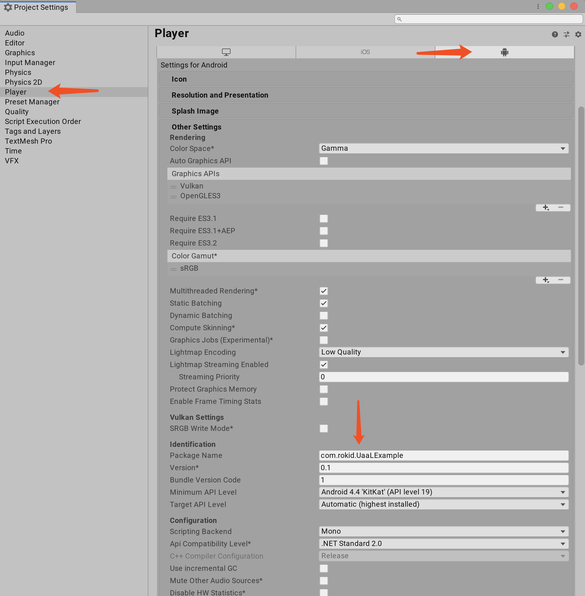

<!-- TOC -->

- [UnityTutorials](#unitytutorials)
    - [1. Build for iOS Simulator](#1-build-for-ios-simulator)
    - [2. Build for Android device](#2-build-for-android-device)
    - [3. Interoperate with Unity and Native](#3-interoperate-with-unity-and-native)
        - [1. iOS call Unity](#1-ios-call-unity)
        - [2. Unity call iOS](#2-unity-call-ios)
        - [3. Android call Unity](#3-android-call-unity)
        - [4. Unity call Android](#4-unity-call-android)
    - [4. Unity as a Library in native (UaaL)](#4-unity-as-a-library-in-native-uaal)
    - [5. Getting Staretd Docs](#5-getting-staretd-docs)

<!-- /TOC -->

# UnityTutorials
Build Unity Project within Android and iOS


## 1. Build for iOS Simulator

1. Edit -> Project setting -> Other setting -> Target SDK -> Simulator SDK
2. Edit -> Project setting -> Player -> uncheck Auto Graphics API add OpenCLES3(Deprecated) or OpenCLES2(Deprecated)
3. File -> Build setting -> Add Open Scenes -> Build 

iOS Simulator Player Setting:



iOS Simulator TargetSDK Setting:


## 2. Build for Android device

1. File -> Build setting -> Android platform -> Switch Platform
2. File -> Build setting -> Add Open Scenes -> check Export Project -> Export

Android Build Setting:


Android Player Settings:


## 3. Interoperate with Unity and Native

### 1. iOS call Unity

call `UnityFramework` instance method directly.
```objc
[[UnityFramework getInstance] sendMessageToGOWithName: @"Game Object"                           
                                        functionName:@"your function name" 
                                        message:@"your message"];
```

### 2. Unity call iOS

write plugin for iOS by `extern "C" {}` expose it in Objective-C++ file (.mm file)

NativeCallProxy.h
```objc
#import <Foundation/Foundation.h>

// NativeCallsProtocol defines protocol with methods you want to be called from managed
@protocol NativeCallsProtocol
@required
- (void) showHostMainWindow:(NSString*)color;
// other methods
@end

__attribute__ ((visibility("default")))
@interface FrameworkLibAPI : NSObject
// call it any time after UnityFrameworkLoad to set object implementing NativeCallsProtocol methods
+(void) registerAPIforNativeCalls:(id<NativeCallsProtocol>) aApi;

@end

```

NativeCallProxy.mm

```objc
#import <Foundation/Foundation.h>
#import "NativeCallProxy.h"


@implementation FrameworkLibAPI

id<NativeCallsProtocol> api = NULL;
+(void) registerAPIforNativeCalls:(id<NativeCallsProtocol>) aApi
{
    api = aApi;
}

@end

extern "C" {
    void showHostMainWindow(const char* color) { return [api showHostMainWindow:[NSString stringWithUTF8String:color]]; }
}
```

C# usage example: call showHostMainWindow()

```csharp
public class NativeAPI {
    [DllImport("__Internal")]
    public static extern void showHostMainWindow(string lastStringColor);

void showHostMainWindow()
    {
#if UNITY_ANDROID
        // call android  
#elif UNITY_IOS
        NativeAPI.showHostMainWindow(lastStringColor);
#endif
    }
```

### 3. Android call Unity

call OverrideUnityActivity\`s instance method `UnitySendMessage(String gameObj, String method, String arg){}` directly

```java
UnitySendMessage("Cube", "ChangeColor", "yellow");
```

### 4. Unity call Android

`OverrideUnityActivity` is public abstract class extends `UnityPlayerActivity` in unityLibray, you can define some method that unity call, for example: `showMainActivity`

```java
public abstract class OverrideUnityActivity extends UnityPlayerActivity
{ 
  public static OverrideUnityActivity instance = null;

  protected void UnitySendMessage(String gameObj, String method, String arg) { mUnityPlayer.UnitySendMessage(gameObj,method,arg); }

  protected FrameLayout getUnityFrameLayout() { return mUnityPlayer; }

  abstract protected void showMainActivity(String setToColor);
  
  @Override
  protected void onCreate(Bundle savedInstanceState)
  {
      super.onCreate(savedInstanceState);
      instance = this;
  }

  @Override
  protected void onDestroy() {
      super.onDestroy();
      instance = null;
  }
}
```

C# usage example: call showHostMainWindow()

```csharp
try
{
    AndroidJavaClass jc = new AndroidJavaClass("com.company.product.OverrideUnityActivity");
    AndroidJavaObject overrideActivity = jc.GetStatic<AndroidJavaObject>("instance");
    overrideActivity.Call("showMainActivity", lastStringColor);
} catch(Exception e)
{
    appendToText("Exception during showHostMainWindow");
    appendToText(e.Message);
}
```


## 4. Unity as a Library in native (UaaL)

[iOS](https://forum.unity.com/threads/integration-unity-as-a-library-in-native-ios-app.685219/)

[UaaLExample-iOS](https://github.com/Beyond-Chao/UnityTutorials/tree/master/UaaLExample-iOS)

[Android](https://forum.unity.com/threads/integration-unity-as-a-library-in-native-android-app.685240/)

[UaaLExample-Android](https://github.com/Beyond-Chao/UnityTutorials/tree/master/UaaLExample-Android)

## 5. Getting Staretd Docs

 1. [Getting started with iOS](https://docs.unity3d.com/Manual/iphone-GettingStarted.html)
 2. [Getting started with Android](https://docs.unity3d.com/Manual/android-GettingStarted.html)